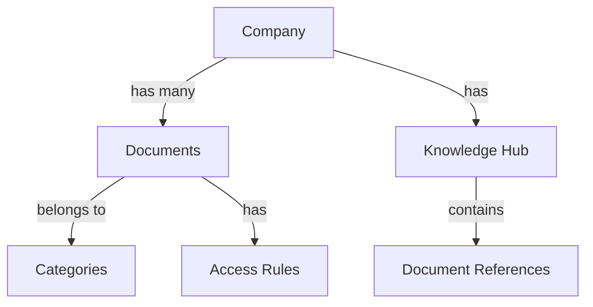
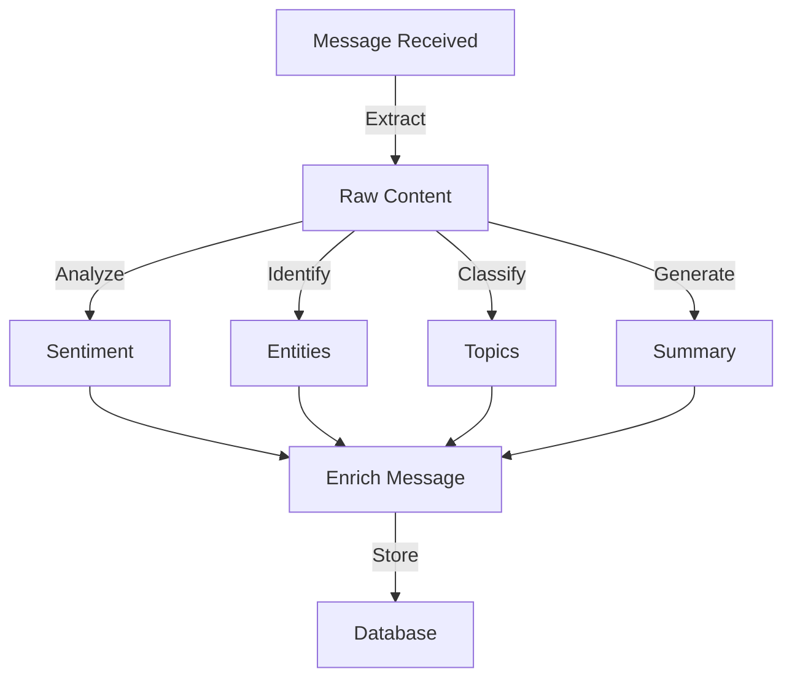

interface DocumentEmbedding {
  documentId: string;
  embedding: number[];  // 1536-dimensional OpenAI embedding
  metadata: {
    title: string;
    category: string;
    lastUpdated: string;
    version: string;
  };
}
```

## Semantic Structure

### Entity Relationships


### Context Boundaries

1. Document Management Domain
```typescript
/**
 * @context DocumentManagement
 * @description Handles document lifecycle and organization
 * @dependencies ['AccessControl', 'Storage', 'Search']
 */
interface DocumentContext {
  boundaries: {
    internal: ['documents', 'categories', 'versions'],
    external: ['users', 'companies', 'permissions']
  };
  operations: ['create', 'read', 'update', 'archive'];
}
```

2. Knowledge Hub Domain
```typescript
/**
 * @context KnowledgeHub
 * @description Manages company-wide document organization
 * @dependencies ['DocumentManagement', 'Search']
 */
interface KnowledgeHubContext {
  boundaries: {
    internal: ['categories', 'access_rules', 'metadata'],
    external: ['documents', 'companies']
  };
  operations: ['organize', 'categorize', 'search'];
}
```

## AI Search Optimization

### Document Preprocessing
```typescript
interface DocumentPreprocessing {
  steps: [
    'text_extraction',
    'content_normalization',
    'metadata_extraction',
    'embedding_generation'
  ];
  
  contentTypes: {
    text: ['plain', 'markdown', 'html'],
    structured: ['json', 'yaml'],
    binary: ['pdf', 'docx']
  };
}
```

### Search Vector Store
```typescript
interface VectorStore {
  schema: {
    id: string;
    embedding: number[];
    metadata: Record<string, unknown>;
    content_hash: string;
    last_updated: string;
  };
  
  indexing: {
    type: 'HNSW';  // Hierarchical Navigable Small World
    parameters: {
      M: 16;       // Maximum number of connections
      efConstruction: 200;
      ef: 50;      // Search accuracy vs speed trade-off
    };
  };
}
```

## Data Flow Annotations

### Document Creation Flow
```typescript
/**
 * @flow DocumentCreation
 * @input CreateDocumentDTO
 * @output DocumentReference
 * @sideEffects ['embedding_generation', 'index_update']
 */
interface DocumentCreationFlow {
  stages: [
    'validation',
    'storage',
    'embedding',
    'indexing',
    'notification'
  ];
  
  fallbacks: {
    embedding_failure: 'retry_with_backoff',
    index_failure: 'queue_for_retry'
  };
}
```

## Vector Search Implementation

### Similarity Search
```typescript
interface VectorSearch {
  parameters: {
    model: 'text-embedding-ada-002';
    dimensions: 1536;
    metric: 'cosine';
  };
  
  preprocessing: {
    text_cleaning: boolean;
    language_detection: boolean;
    semantic_chunking: boolean;
  };
  
  postprocessing: {
    reranking: boolean;
    filtering: boolean;
    aggregation: boolean;
  };
}
```

## AI-Assisted Features

### Content Analysis
```typescript
interface ContentAnalysis {
  features: {
    sentiment_analysis: boolean;
    entity_recognition: boolean;
    topic_modeling: boolean;
    summary_generation: boolean;
  };
  
  models: {
    sentiment: 'distilbert-base-uncased-finetuned-sst-2-english';
    ner: 'bert-base-NER';
    summarization: 'facebook/bart-large-cnn';
  };
}
```

### Document Classification
```typescript
interface DocumentClassification {
  categories: {
    type: string[];     // ['contract', 'proposal', 'report']
    department: string[]; // ['legal', 'sales', 'engineering']
    priority: string[];  // ['high', 'medium', 'low']
  };
  
  classification: {
    method: 'zero_shot';  // Zero-shot learning for flexibility
    confidence_threshold: 0.85;
    multi_label: boolean;
  };
}
```

## Content Analysis Pipeline

### Message Content Analysis
```typescript
interface MessageAnalysis {
  stages: [
    'preprocessing',
    'content_extraction',
    'sentiment_analysis',
    'entity_recognition',
    'topic_classification',
    'summarization'
  ];

  workflow: {
    entry_point: 'message_received';
    exit_point: 'analysis_complete';
    error_handling: 'retry_with_backoff';
  };

  outputs: {
    sentiment: {
      score: number;
      confidence: number;
      emotions: string[];
    };
    entities: {
      type: string;
      value: string;
      confidence: number;
    }[];
    topics: string[];
    summary: string;
  };
}
```

### Real-time Processing
```typescript
interface RealTimeProcessor {
  batch_size: number;
  processing_window: number;  // milliseconds
  max_latency: number;

  features: {
    stream_processing: boolean;
    partial_results: boolean;
    progressive_enhancement: boolean;
  };

  optimization: {
    caching: boolean;
    model_quantization: boolean;
    batch_processing: boolean;
  };
}
```

### Content Enrichment Flow


## Integration Points

### 1. Message Processing
```typescript
async function processMessage(message: Message): Promise<EnrichedMessage> {
  // 1. Extract content
  const content = await extractContent(message);

  // 2. Parallel processing
  const [sentiment, entities, topics] = await Promise.all([
    analyzeSentiment(content),
    extractEntities(content),
    classifyTopics(content)
  ]);

  // 3. Sequential processing (depends on previous results)
  const summary = await generateSummary(content, {
    entities,
    topics
  });

  // 4. Enrich message
  return {
    ...message,
    analysis: {
      sentiment,
      entities,
      topics,
      summary
    }
  };
}
```

### 2. Feedback Loop
```typescript
interface FeedbackSystem {
  sources: {
    user_interactions: boolean;
    message_responses: boolean;
    engagement_metrics: boolean;
  };

  metrics: {
    accuracy: number;
    relevance: number;
    usefulness: number;
  };

  adaptation: {
    threshold: number;
    learning_rate: number;
    update_frequency: string;
  };
}
```

### 3. Performance Monitoring
```typescript
interface AnalyticsMonitor {
  metrics: {
    processing_time: {
      p50: number;
      p95: number;
      p99: number;
    };
    accuracy: {
      sentiment: number;
      entities: number;
      topics: number;
    };
    resource_usage: {
      memory: number;
      cpu: number;
      gpu: number;
    };
  };

  alerts: {
    latency_threshold: number;
    error_rate_threshold: number;
    accuracy_threshold: number;
  };
}
```

## Best Practices

### 1. Model Selection
- Use lightweight models for real-time processing
- Consider model quantization for improved performance
- Implement model versioning for consistent results
- Monitor model drift and performance degradation

### 2. Content Processing
- Implement proper text normalization
- Handle multiple languages appropriately
- Consider context window limitations
- Use appropriate tokenization strategies

### 3. Error Handling
- Implement graceful degradation
- Use fallback models when necessary
- Monitor and log failure patterns
- Implement retry strategies with backoff

### 4. Performance Optimization
- Use caching for frequent patterns
- Implement batch processing where appropriate
- Consider streaming for large content
- Optimize model loading and unloading

## Security Considerations

### 1. Content Safety
```typescript
interface ContentSafety {
  checks: {
    toxic_content: boolean;
    sensitive_information: boolean;
    compliance_rules: string[];
  };

  actions: {
    block: string[];
    flag: string[];
    log: string[];
  };

  reporting: {
    audit_trail: boolean;
    notification_channels: string[];
    retention_period: number;
  };
}
```

### 2. Data Privacy
- Implement proper data anonymization
- Handle PII appropriately
- Follow data retention policies
- Ensure secure model access

## Monitoring and Maintenance

### 1. Quality Assurance
```typescript
interface QualityMetrics {
  accuracy: {
    sentiment: number;
    entity: number;
    topic: number;
  };

  performance: {
    latency: number;
    throughput: number;
    error_rate: number;
  };

  resources: {
    memory_usage: number;
    cpu_usage: number;
    api_calls: number;
  };
}
```

### 2. Continuous Improvement
- Regular model retraining
- Performance optimization
- Feature enhancement
- User feedback incorporation

## AI Model Integration Guidelines

### Model Selection Criteria
```typescript
interface ModelRequirements {
  performance: {
    latency: '<100ms';
    throughput: '>100 requests/second';
    accuracy: '>95%';
  };
  
  resources: {
    memory: '<2GB';
    gpu: 'optional';
    cost: 'low';
  };
  
  features: {
    streaming: boolean;
    batching: boolean;
    caching: boolean;
  };
}
```

### Model Deployment Strategy
```typescript
interface ModelDeployment {
  stages: [
    'validation',
    'versioning',
    'deployment',
    'monitoring'
  ];
  
  monitoring: {
    metrics: ['latency', 'accuracy', 'drift'];
    alerts: ['error_rate', 'latency_spike'];
    logging: ['input', 'output', 'performance'];
  };
}
```

## AI-Optimized Data Schemas

### Document Schema
```typescript
/**
 * @schema Document
 * @description AI-optimized document schema with semantic annotations
 */
interface AIDocument {
  content: {
    text: string;
    embedding: number[];
    chunks: {
      text: string;
      embedding: number[];
      position: number;
    }[];
  };
  
  metadata: {
    semantic_type: string;
    language: string;
    complexity: number;
    key_entities: string[];
  };
}
```

### Search Schema
```typescript
/**
 * @schema Search
 * @description AI-powered search configuration
 */
interface AISearch {
  query: {
    text: string;
    filters: Record<string, unknown>;
    embedding: number[];
  };
  
  ranking: {
    semantic_score: number;
    relevance_score: number;
    recency_score: number;
  };
}